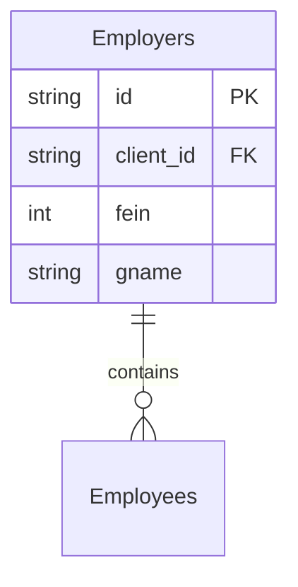
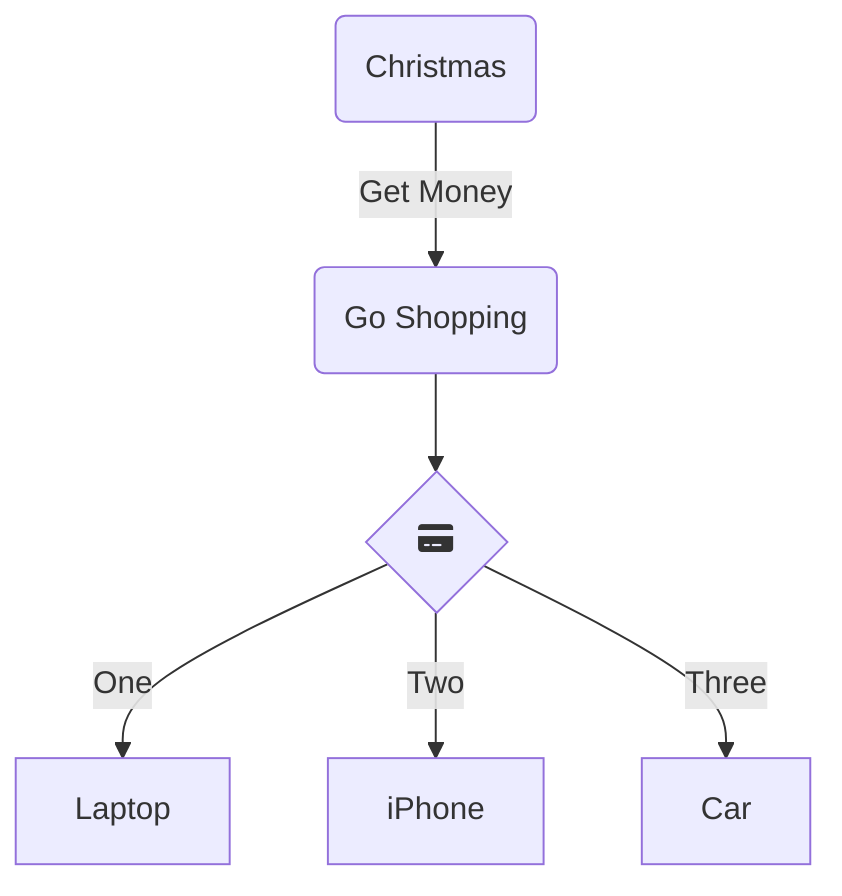
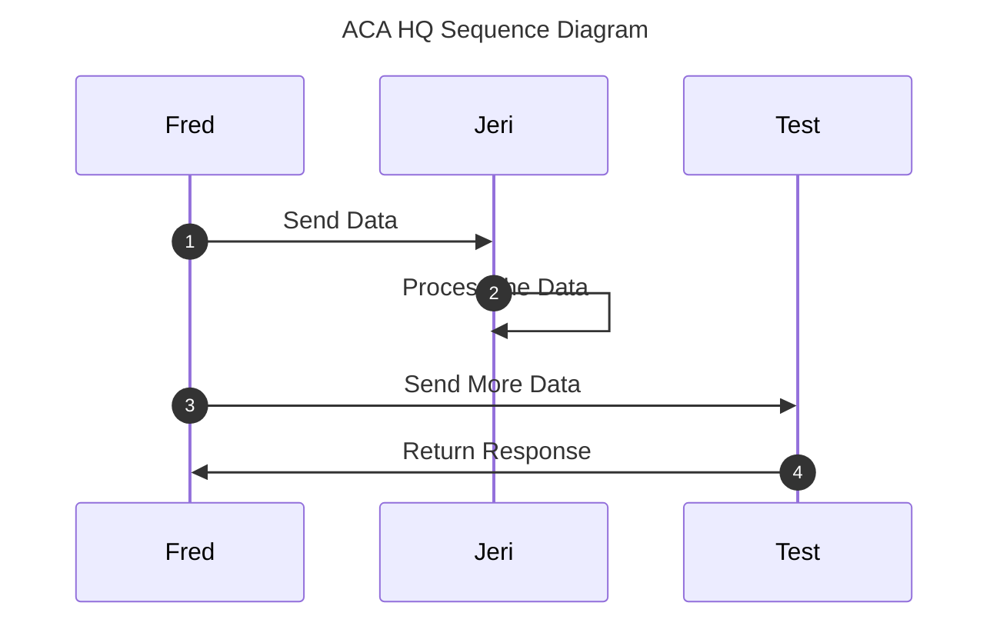

```mermaid
erDiagram
  Employers ||--o{Employees: contains
  Employers {
    string id PK
    string client_id FK
    int fein
    string gname
  }
```

# Flowchart

```mermaid
flowchart TD
  A(Christmas) -->|Get Money| B(Go Shopping)
  B --> C{fa:fa-credit-card}
  C -->|One| D[Laptop]
  C -->|Two| E[iPhone]
  C -->|Three| F[Car]
```

# Sequence Diagram

```mermaid
---
title: ACA HQ Sequence Diagram
---
%%{
  init: {
    'rightAngles': true,
    'showSequenceNumbers': true,
    'useMaxWidth': true
  }
 }%%
 sequenceDiagram
  participant f as Fred
  participant j as Jeri
  participant t as Test
  
  f ->> j: Send Data
  j ->> j: Process the Data
  f ->> t: Send More Data
  t ->> f: Return Response
```
